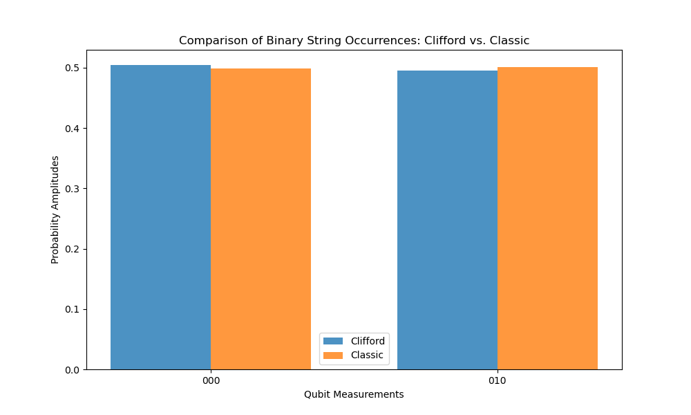
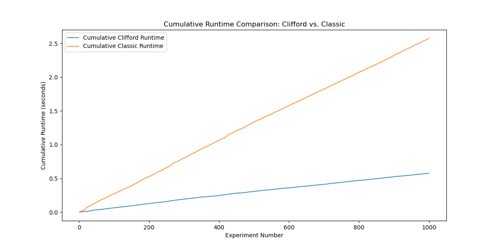
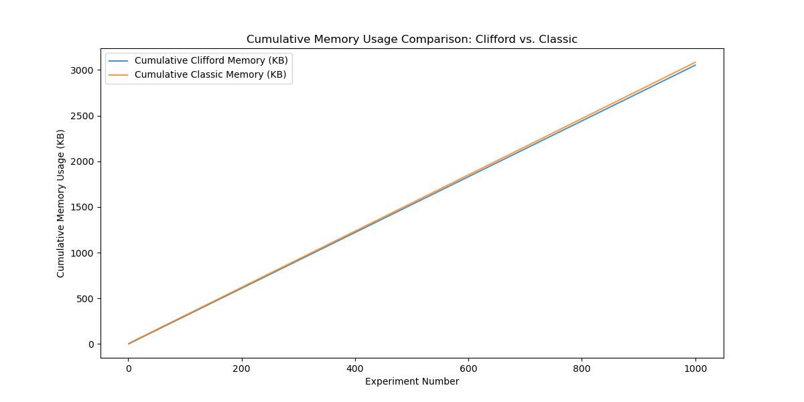
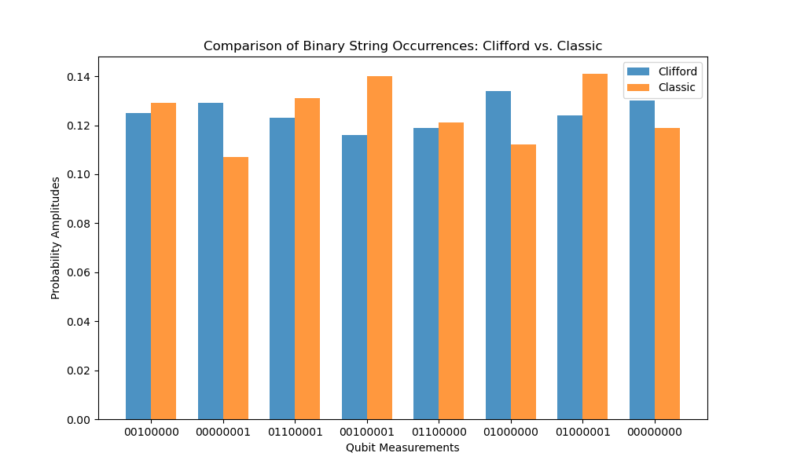
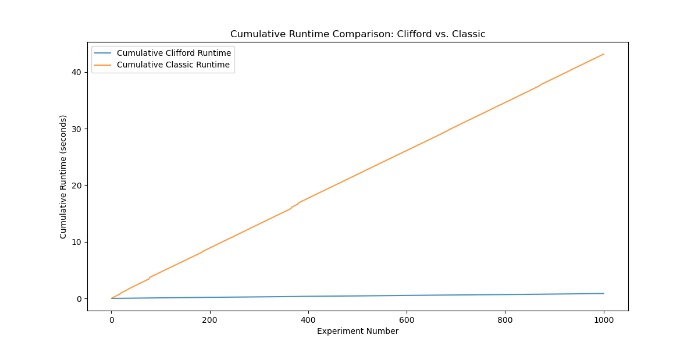
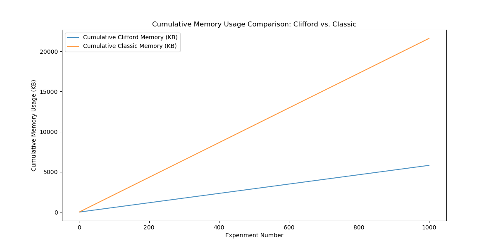

# Quantum Circuit Simulation Framework

This project focuses on building a simulation framework for quantum circuits from scratch, emphasizing **Clifford dynamics**. The implementation relies exclusively on Python standard libraries, prioritizing efficiency and correctness. Some of the algorithms implemented in this project are based on the following paper: https://www.scottaaronson.com/papers/chp6.pdf

## Objectives

1. **Initialization of $n$-qubit states:**
   - Implement $n$-qubit initialization using a $2^n$ **state vector**.
   - Develop a tableau-based representation of $n$-qubit states.

2. **Application of Clifford gates:**
   - Implement key Clifford gates, including **CNOT**, **Hadamard (H)**, and **Phase (S)** gates.
   - Enable the application of gates to $n$-qubit states.

3. **Measurement of $n$-qubit states:**
   - Support **deterministic and random measurements** on single qubits.
   - Efficiently simulate measurement outcomes.

By simulating a quantum computer with:
- A full $2^n$-state vector (referred to as the **vector simulator**),
- And a **tableau-based Clifford simulator**,  

The project compares the performance and scalability of these two approaches.

---

## Results

### 1. Validation of Implementations
Both simulators were validated using randomly generated Clifford circuits. Measurement outcomes and probability amplitudes were compared between the two implementations.

- **Key Observation**: Both simulators showed **consistent results** across all tests, with no discrepancies in measured states.
- **Probability Amplitudes**: Consistent computation of amplitudes across both approaches confirmed their accuracy.

---

### 2. Performance Comparison

The efficiency of the simulators was compared by evaluating runtime and memory usage across 1,000 runs of $n$-qubit circuits.

- **Runtime Analysis**:  
  The Clifford simulator exhibited **significantly faster execution times** for larger $n$-qubit circuits compared to the vector simulator.

- **Memory Usage**:  
  The vector simulator performed competitively in memory usage for circuits up to 6 qubits but was outperformed by the Clifford simulator for larger systems.

---

### 3. Key Observations

1. The **Clifford simulator** excels in scalability, efficiently handling large $n$-qubit circuits, making it ideal for **Clifford dynamics**.
2. The **state vector simulator** is valuable for verifying correctness but is limited in performance for larger systems.
3. Both simulators **produced consistent results**, validating their implementation for state evolution and measurements.

---

## Summary

This framework demonstrates the strengths of both simulation approaches:
- The **Clifford simulator** is highly efficient and scalable, optimized for Clifford circuits.
- The **state vector simulator** provides a reliable tool for validation and small-scale circuit analysis.

By comparing these methods, the project offers insights into the trade-offs between correctness and efficiency in quantum circuit simulation.

--- 

### More Results

The results shown above are just a comparative example at the efficiency boundary of both quantum computing frameworks. The following Images showcase the same relations but for a random 8 qubit circuit.

